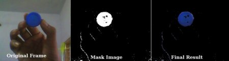

# هدف
درا ین قسمت یاد میگیریم یه عکس رو چطوری از یک فضای رنگی به یک فضای رنگی دیگه ببریم
مثل : RGB -> HSV,....

بیشتر از 150 تا روش برای تبدیل فضاهای رنگی در این کتابخونه وجود داره و ما 2 موردش رو برسی میکنیم
تبدیل BGR به Gray و BGR به HSV


برای تبدیل رنگ، ما از تابع cv.cvtColor(input_image, flag) استفاده می‌کنیم که در آن flag نوع تبدیل رو مشخص میکنه.
* برای تبدیل BGR به Gray، از پرچم `cv.COLOR_BGR2GRAY` استفاده می‌کنیم.
* برای تبدیل BGR به HSV، از پرچم `cv.COLOR_BGR2HSV` استفاده می‌کنیم.

بقیه پرجم ها(flag) توسط اینطوری میتونید پیدا کنید:

```python
import cv2 as cv
flags = [i for i in dir(cv) if i.startswith('COLOR_')]
print(flags)
```

نکته: برای HSV، محدوده‌ی Hue بین [0,179]، Saturation بین [0,255] و Value بین [0,255] است. نرم‌افزارهای مختلف ممکن است از مقیاس‌های متفاوتی استفاده کنند، بنابراین اگر می‌خواهید مقادیر OpenCV را با آنها مقایسه کنید، باید این مقادیر را نرمال‌سازی کنید.

# ردیابی شیء
حالا که تونستیم RGB رو به HSV تبدیل کنیم میتونیم از این روش برای استخراج یک شی استفاده کنیم
در فضای HSV نمایش یک رنگ نسبت به BGR راحت تره .
الان میخوایم یک شی آبی رنگ رو استخراج کنیم

روش کار :

هر فریم از ویدیو را بگیرید.
فریم را از BGR به فضای رنگی HSV تبدیل کنید.
تصویر HSV را برای یک محدوده رنگ آبی آستانه‌گذاری کنید.
حالا شیء آبی را به تنهایی استخراج کنید، می‌توانیم هر کاری با آن تصویر انجام دهیم.

```python
import cv2 as cv
import numpy as np
 
cap = cv.VideoCapture(0)
 
while(1):
 
    # هر فریم را بگیرید
    _, frame = cap.read()
 
    # تبدیل BGR به HSV
    hsv = cv.cvtColor(frame, cv.COLOR_BGR2HSV)
 
    # تعریف محدوده رنگ آبی در HSV
    lower_blue = np.array([110, 50, 50])
    upper_blue = np.array([130, 255, 255])
 
    # آستانه‌گذاری تصویر HSV برای دریافت فقط رنگ‌های آبی
    mask = cv.inRange(hsv, lower_blue, upper_blue)
 
    # انجام عمل AND بیت‌وار بین ماسک و تصویر اصلی
    res = cv.bitwise_and(frame, frame, mask=mask)
 
    cv.imshow('frame', frame)
    cv.imshow('mask', mask)
    cv.imshow('res', res)
    k = cv.waitKey(5) & 0xFF
    if k == 27:  # برای خروج از حلقه، دکمه Escape را فشار دهید
        break
 
cv.destroyAllWindows()
```
نتیجه کار : 


نکته : در تصویر ممکنه مقداری نویز ببینید که این مشکل در فصل های بعدی حل میشه
این روش ساده ترین روش استخراج اشیا هست

# چگونه مقادیر HSV برای ردیابی را پیدا کنیم؟
این یک سوال بسیار رایجه شما میتونید از تابع `cv.cvtColor()` استفاده کنید
به جای دادن تصویر فقط مقادیر رنگ تصویر رو بدیم و بعد تبدیل به HSV کنیم
نمونه : 
```python
green = np.uint8([[[0, 255, 0]]])
hsv_green = cv.cvtColor(green, cv.COLOR_BGR2HSV)
print(hsv_green)
```

اکنون می‌توانید [H-10, 100, 100] و [H+10, 255, 255] را به عنوان حد پایین و حد بالای خود انتخاب کنید.


# توضیحات اضافه
در این کد، از چند تابع مهم OpenCV برای پردازش تصویر و ردیابی اشیاء استفاده شده است. بگذارید هر یک از این توابع را مختصراً بررسی کنیم:

`cv.VideoCapture(0)`:
این تابع برای شروع ضبط ویدیو از دوربین استفاده می‌شود. عدد 0 به دوربین پیش‌فرض سیستم اشاره دارد، و اگر شما دوربین دیگری دارید، می‌توانید این عدد را تغییر دهید.

`cap.read()`:
این تابع یک فریم از ویدیو را می‌خواند. نتیجه آن یک لیست شامل دو مقدار است: یک بولین که نشان می‌دهد آیا خواندن فریم موفق بوده یا نه، و خود فریم تصویر.

`cv.cvtColor(frame, cv.COLOR_BGR2HSV)`:
با استفاده از این تابع، تصویر را از فضای رنگی BGR به HSV تبدیل می‌کنیم. این تبدیل به ما کمک می‌کند تا رنگ‌ها را راحت‌تر در فضای HSV شناسایی کنیم.

`np.array([lower_blue])` و `np.array([upper_blue])`:
این خطوط برای تعریف محدوده رنگ آبی استفاده می‌شوند. lower_blue و upper_blue به ترتیب نشان‌دهنده حداقل و حداکثر رنگ آبی در فضای HSV هستند.

`cv.inRange(hsv, lower_blue, upper_blue)`:
این تابع آستانه‌گذاری تصویر HSV را انجام می‌دهد و یک ماسک باینری تولید می‌کند. در این ماسک، مقادیر رنگی در محدوده تعیین‌شده (رنگ آبی) به ۱ و بقیه مقادیر به ۰ تبدیل می‌شوند.

`cv.bitwise_and(frame, frame, mask=mask)`:
این تابع برای اعمال عملیات AND بیت‌وار بین تصویر اصلی و ماسک استفاده می‌شود. با این کار، فقط بخش‌هایی از تصویر که رنگ آبی دارند (بر اساس ماسک) در خروجی نشان داده می‌شوند.

`cv.imshow('frame', frame)`:
با استفاده از این تابع، تصویر اصلی را نمایش می‌دهیم. نام پنجره 'frame' است و این نام به ما کمک می‌کند تا پنجره‌ها را شناسایی کنیم.

`cv.imshow('mask', mask)`:
این تابع برای نمایش ماسک باینری تولید شده استفاده می‌شود که فقط رنگ‌های آبی را نشان می‌دهد.

`cv.imshow('res', res`):
این تابع برای نمایش تصویر نهایی (خروجی) که تنها شامل رنگ آبی است، استفاده می‌شود.

`cv.waitKey(5)`:
این تابع به مدت ۵ میلی‌ثانیه منتظر می‌ماند تا یک کلید فشرده شود. اگر کلید Escape (کد ۲۷) فشرده شود، حلقه متوقف می‌شود.

`cv.destroyAllWindows()`:
این تابع برای بستن تمامی پنجره‌های بازشده OpenCV استفاده می‌شود.

به‌طور خلاصه، این توابع به ما این امکان را می‌دهند که تصاویر و ویدیوها را بخوانیم، فضای رنگی را تغییر دهیم و اشیاء رنگی را ردیابی کنیم. این یک رویکرد ساده و کارآمد برای پردازش تصویر است!


